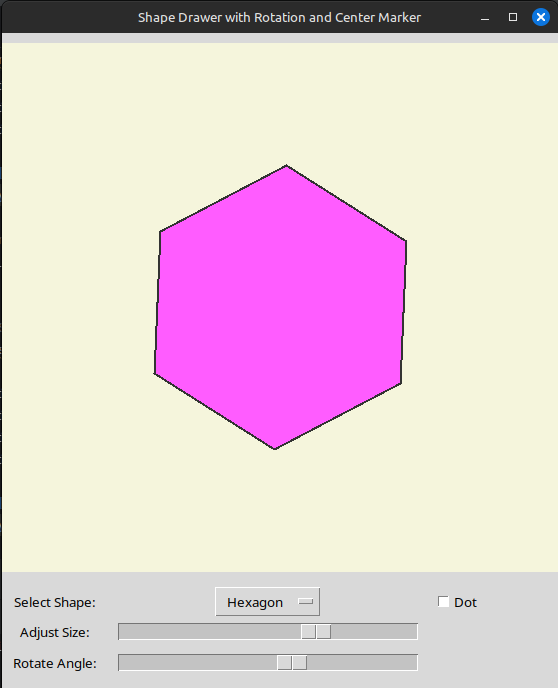

# Shape Drawer with Rotation and Center Marker  

This is a **Python Tkinter** application that allows users to draw, resize, and rotate various geometric shapes. It provides an interactive UI with sliders for adjusting the shape size and rotation angle.  

## 🖼️ Screenshot  


## ✨ Features  
- 🖌️ **Draw Different Shapes** (Hexagon, Square, Triangle, etc.)  
- 🔄 **Rotate Shapes** using a slider  
- 📏 **Resize Shapes** dynamically  
- 🎯 **Optional Center Marker** for precision  
- 🎨 **Custom Colors & UI Theme**  

## 🛠️ Libraries Used  
This project is built using the following Python libraries:  

## Requirements  
Make sure you have the following dependencies installed:  
- Python 3.x  
- `tkinter` (built-in with Python)  
- `math` (For calculations)  

To install , run:  
```bash
pip install math
pip install python3-tk
